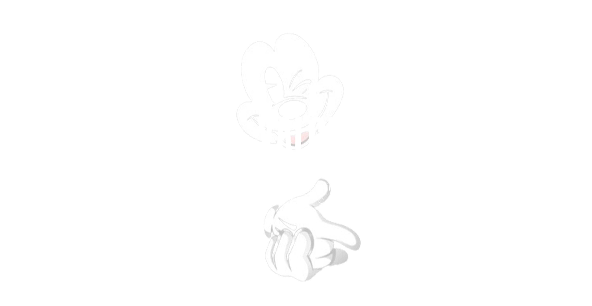
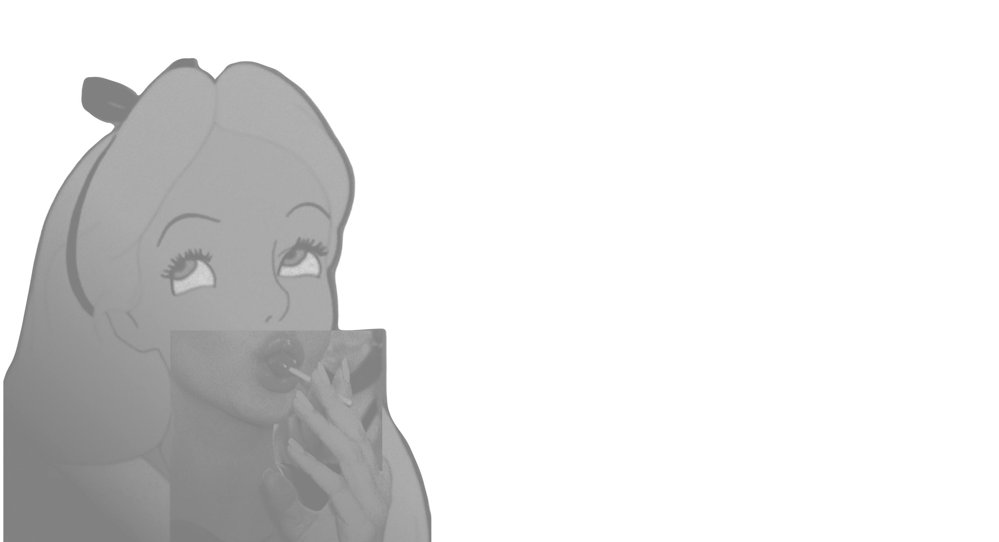
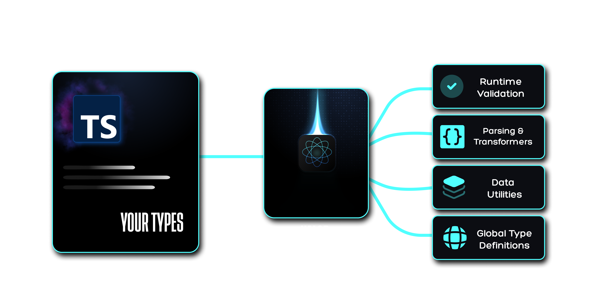

<p align="center">
  
</p>

<div align="center">
  <a href="https://www.npmjs.com/package/@bgskinner2/xalor">
    
  </a>
  <a href="https://www.npmjs.com/package/@bgskinner2/xalor">
    
  </a>
  <a href="https://github.com">
    
  </a>
  <a href="https://bundlephobia.com/package/@bgskinner2/xalor">
    
  </a>
</div>

&nbsp;

<p align="center">
  📦 <a href="https://github.com/bgskinner3/axiom-kit/blob/main/packages/xalor/docs/Installation.md">Installation</a> • 
  📖 <a href="https://github.com/bgskinner3/axiom-kit/blob/main/packages/xalor/docs/api.md">Documentation</a> • 
  ⚙️ <a href="https://github.com/bgskinner3/axiom-kit/blob/main/packages/xalor/docs/api.md">API Reference</a>
</p>

---

&nbsp;

<div align="center">
  <p style="font-size:20px; max-width:700px;">
    <em>“A build-time TypeScript engine that turns your native types into a live runtime validation and generation system — without duplicating schemas or shipping heavy validation libraries.”</em>
  </p>
</div>

&nbsp;

## 💥 The Runtime Gap

TypeScript ends at compile time. Your application does not. At runtime, type safety is historically rebuilt manually across the development stack:

- APIs trust external payload data inputs by default.
- Validation parameters are re-implemented loosely inside custom schemas, guards, and DTO structures.
- Heavy validation libraries like Zod or io-ts duplicate your TypeScript models entirely at runtime.
- Structural type drift inevitably emerges between compile-time definitions and execution realities.
- Every system boundary re-expresses the same data rules in a completely different form.

**The Result:** Type safety becomes a tax of duplicated intent, rather than an enforced structural law. At runtime, TypeScript ceases to be a constraint — it becomes mere documentation.

&nbsp;

<p align="center">
  
</p>

&nbsp;

## ⚡ The Inversion

Xalor permanently removes the boundary between compile-time and runtime by compiling your native TypeScript types into persistent, content-addressed metadata graphs. Your types are no longer erased after build — they become a live structural registry that powers complex runtime behaviors.

Instead of declaring heavy schemas alongside your types, Xalor treats standard TypeScript code as the **Single Source of Truth** and compiles it directly into an active runtime type system.

- ❌ **No schema duplication** (Write types once, derive everything else).
- ❌ **No type drift** between compile-time layout and production execution.
- ❌ **No external validation libraries** shipped in your production client bundle.
- ❌ **No re-declared models** across different layer boundaries.

Just native TypeScript types → compiled into a live runtime system.

Write types once.  
Everything else is derived.

---

&nbsp;

<p align="center">
  
</p>

&nbsp;

## ⚖️ Xalor vs Schema-Based Runtime Systems

| Capability                              |          Xalor          |     Zod / Ajv      |
| --------------------------------------- | :---------------------: | :----------------: |
| Persistent type graph                   |           ✔️            |         ❌         |
| IDE ↔ runtime shared registry           |           ✔️            |         ❌         |
| Source-code traceability (GPS errors)   |           ✔️            |         ❌         |
| Multi-layer type storage (Vault system) |           ✔️            |         ❌         |
| Build-time type compilation             |           ✔️            |         ❌         |
| Single source of truth (TS-only)        |           ✔️            |         ❌         |
| Runtime model                           | Precompiled type system | Runtime validation |
| Schema duplication required             |           ❌            |         ✔️         |

&nbsp;

&nbsp;

## 📦 Install

```bash

npm install @bgskinner2/xalor
npm install --save-dev ts-patch typescript

```

---

## ⚡ Quick Start

Xalor works by compiling your native TypeScript types into a persistent runtime type system during your normal build process.

No runtime setup required — just install, configure once, and use native TypeScript.

👉 Full setup & configuration guide: [Installation & Config Docs](https://github.com/bgskinner3/axiom-kit/blob/main/packages/xalor/docs/Installation.md)

---

&nbsp;

&nbsp;

## 🧪 API Peek

### `registerXalor<"KEY", Type>()` (The Registor)

A single gateway for registering types into the global Xalor registry.  
Supports multiple overload patterns through a unified API surface.

### 🧬 Type Injection

```ts
type TUser = {
  id: number;
  name: string;
  address: {
    street: string;
    city: string;
  };
};

/**
 * Associates a compile-time TypeScript type with a global registry key.
 *
 * In development mode, saving the file (or triggering a build) will
 * automatically register this type into the runtime registry.
 *
 * With IDE integration enabled, registration happens immediately on save.
 */

registerXalor<'USER_KEY', TUser>();
```

### 📦 Object Inference (flexible API)

Or Just pass Your Whole Data Object

```ts
const userData = {
  id: 1,
  name: 'Alex Carter',
  address: {
    street: '42 West Market St',
    city: 'New York',
  },
};

/**
 * The API is not limited to declared TypeScript types.
 *
 * You can also register runtime data objects directly, using the
 * provided key as the registry identifier.
 *
 * This allows rapid prototyping without explicit type declarations.
 */
registerXalor<'USER_TEST_4'>(userData);
```

Either way you register to the vault your type its pormised to be gloablly acessible and aviablbe to any other of our runtime APis

---

&nbsp;

### `validateXalor` (The Validator)

A multi-mode runtime type gateway for checking, asserting, and parsing data from your compiled TypeScript registry.

### 🛡️ Guard (type-safe predicate)

```ts
/**
 * Creates a runtime type guard derived from the registered "USER" type.
 *
 * Once a type is registered, it becomes globally available across all APIs
 * via the shared runtime type registry.
 *
 * This removes the need for manually writing and maintaining separate
 * validation or guard functions.
 */
const isUser = validateXalor<'USER', 'guard'>();

if (isUser(data)) {
  // fully typed as User
}
```

### ⚡ Parse (safe transformation)

```ts
/**
 * Parses unknown input into a strongly typed "USER" object.
 *
 * If validation fails, the runtime safely handles the failure path
 * using the internal registry rules.
 */
const parseUser = validateXalor<'USER', 'parse'>();

const user = parseUser(data);

// Example of internal failure handling (conceptual):
// return fallbackValue;
```

All APIs are powered by a single compiled TypeScript registry, enabling shared access across validation, parsing, and generation layers without duplicated schemas or external validation systems.

👉 Full API reference: [Full API](https://github.com/bgskinner3/axiom-kit/blob/main/packages/xalor/docs/api.md)

---

&nbsp;

## ✨ Core Features

- ✔ **Native TypeScript → Runtime System:** Your types become executable code variables at build-time.
- ✔ **Persistent Structural Type Graph (Vault System):** Types are safely cached, reused, and never re-declared.
- ✔ **Shared IDE + Runtime Registry:** One uniform data vocabulary powering both editor completion and execution.
- ✔ **Zero Schema Duplication:** Wipes out the need for duplicate, mirrored Zod-style data schemas.
- ✔ **Tree-Shakeable by Design:** Multi-line pure annotations allow minifiers to strip unused metadata completely.
- ✔ **Zero-Footprint Runtime Overhead:** Complex operations are handled entirely during builds, not inside the execution thread.

👉 **Explore the full feature manifest:** [Framework Features Guide](https://github.com/bgskinner3/axiom-kit/blob/main/packages/xalor/docs/features.md)

---

## 📄 License

This project is licensed under the MIT License.

© 2024 Brennan Skinner
